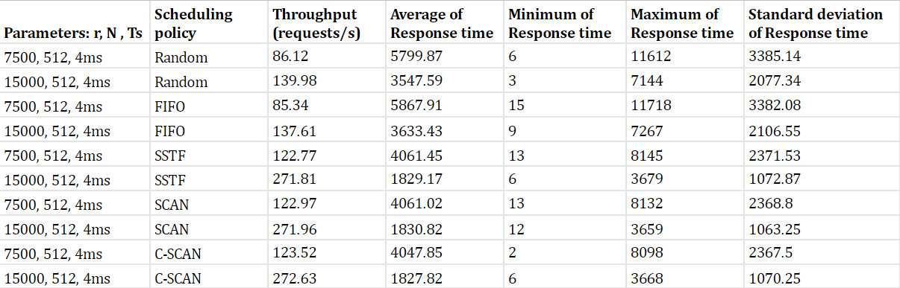
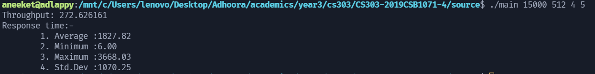

# CS303 Assignment 5
Submitter name: Aneeket Mangal\
Roll No.: 2019CSB1071\
Course:  CS303

## 1. What does this program do
* This C program simulates the read, write and seek operations of a disk. It can be observed using 5 different scheduling policies:
    * Random
    * FIFO
    * SSTF
    * SCAN
    * C-SCAN

A certain amount of random requests are generated which are then sent to the disk scheduler which appropriately orders them and sends them to the disk for service by calling its read, write and seek functions.

Finally the values are used to calculate scheduling algorithm's throughput, response time (sum, min, max, average, variance and standard deviation)

* There are following constants during the execution of the program
    * Rational speed of the disk, r revolutions per minute.
    * Average seek time Ts in ms.
    * Sector size, N in bytes.
    * number of cylinders on the disk
    * number of sectors of the disk.

## 2. A description of how this program works 
* First a certain amount of random requests are generated.
* Each random request consists of address (<platter, cylinder, sector>) and number of requested blocks.
* All these requests are sent to the disk scheduler which appropriately orders them according the scheduling policies used.
* Finally throughput and response times are calculated and given out as output.
***ASSUMPTIONS***
* At max 20 sectors can be requested in a request.
* All requests are generated at once and sent to dispatcher.
 

## 3. How to compile and run this program
* Navigate to ```source``` directory inside main directory.
* Compile using ```gcc main.c -o main -lm```.
* Run the program using ```./main [rotational speed]  [sector size] [average seek time] [scheduling algorithm]```.
* A sample example would be ```./main 15000 512 4 1```
* To run various scheduling algorithm, we have:
    * 1 -> Random
    * 2 -> FIFO
    * 3 -> SSFT
    * 4 -> SCAN
    * 5 -> CSCAN 


---

**ANALYSIS AND OBSERVATIONS**
* Observation table is present in ```documentation``` folder (output.png and output.pdf).
* The set of request can be found in request_set.txt. The format for the request is:
```platter cylinder sector sector_count```
* There are 1000 requests.
* From the data we can observe that:
    * Random ≈ FIFO < SSTF ≈ SCAN ≈ CSCAN (Throughput)
* The three algorithms scan, cscan, sstf have similar throughput because they will server request in almost identical order due to the random nature of request. Due to which the request would be uniform and hence they scheduling policies would work in a similar way.
* Also SCAN, CSCAN, SSTF are better than FIFO because they handle request with closer track, hence saving seek time.
* From the data we can observe that:
    * Random ≈ FIFO > SSTF ≈ SCAN ≈ CSCAN (Average Response time)
* SCAN & C-SCAN would behave similarly due to uniform nature of the input data.
* <b>Observation table</b>

## 4. Provide a snapshot of a sample run


